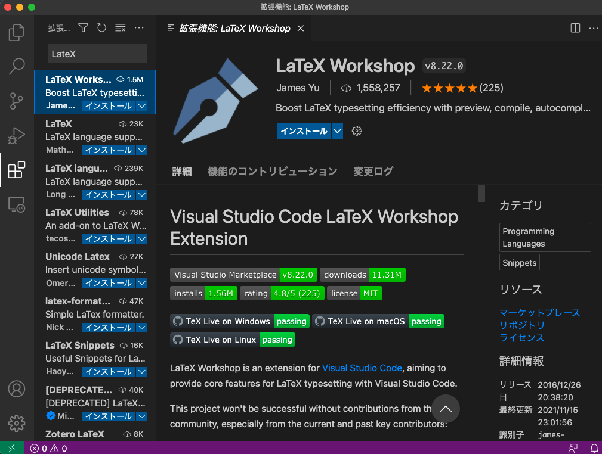
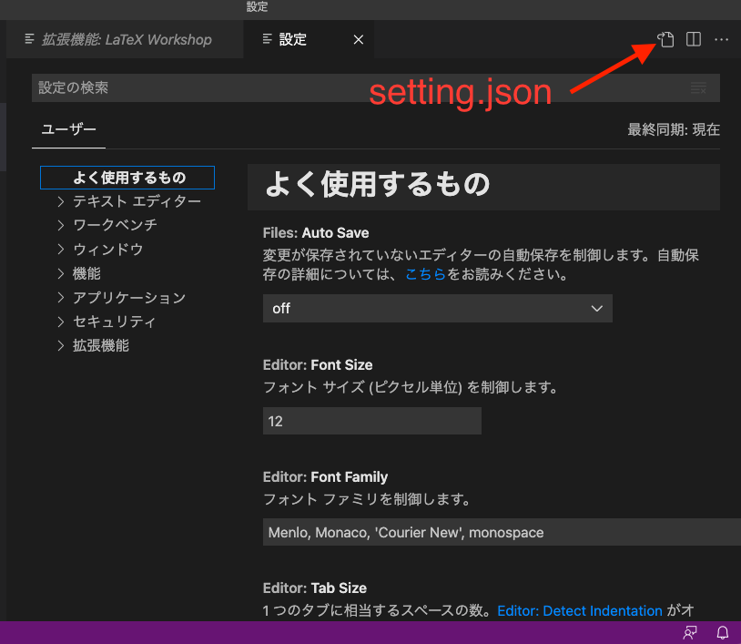

# Texで書く
# 01 インストール編

---

# 目次
1. Texについて
    1. 何故Texを使うのか？
    2. TexとWordとの比較
2. Texのインストール
    1. Mac
    2. Windows
3. 書きやすいTexのテキストエディター


---
# 1. Texについて
## Texとは
TeX は著名なコンピュータ科学者 Donald E. Knuth によって生み出された最強の文書整形システムである．

## Latexとは
LaTeX は TeX の上に構築されたフリーの文書処理システム．
TeX は「組版のために開発された言語」でもあり，そのままでは使いにくい点もあるが，LaTeXでは一般的な文書作成に便利な機能拡張がなされている．

---
## 1.1 何故Texを使うのか？

- 複雑な数式でもきれいに書ける
- 論文のような文書を作成するのに適している
- Microsoft Windows、OS X、Unix互換OS(Linux OS、BSD系OS)、モバイルオペレーティングシステム（Android OS，iOS など）等、多くの OS 上で利用できる
- TeX のソースファイルはテキストファイルなので、異なるシステムでもソースを共通に使え、電子メールでも簡単に交換できる。さらに、ソースファイルを TeX で処理して得られる DVI ファイルもハードウェアに依存しない
- フリーソフトウェアである

**長いレポートや論文をきれいに作りたい時に有効**

---
## 1.2 TexとWordとの比較 ①
## Word
- 短いレポートや体裁をあまり気にしないレポートに有効
- 見た目を派手にしたい時やカラフルにしたい時に有効
- 数式をきれいに入れるのが難しい
- 参考文献の番号付けが手動

## Tex
- 長いレポートや体裁をきれいに整えたい時に有効
- 見た目をシンプルかつ，かっこよくしたい時に有効
- 数式をきれいに入れるのが簡単
- 参考文献の番号付けが自動

---

## 1.2 TexとWordとの比較 ②
## Word
- 図の配置が手動で，自由に配置可能
- 図番号が手動
- アカウント必要


## Tex
- 図の配置が自動で，制限がある
- 図番号が自動(図の位置を変えても自動で変更される)
- アカウント不要

---
# 2. Texのインストール
## Windows
[Tex Live](https://texwiki.texjp.org/?TeX%20Live%2FWindows)(TeX のディストリビューション)

## Mac
[MacTex](https://texwiki.texjp.org/?Mac)(TexLive+ macでの設定が追加されている)

---
# 3. 書きやすいTexのテキストエディター
## 汎用テキストエディタ
 [VS Code](https://qiita.com/rainbartown/items/d7718f12d71e688f3573), [Atom](https://qiita.com/kurohune538/items/6c1e48f6380b87fd8161), [Sublime Text](https://aki-m86.hatenablog.jp/entry/2020/08/08/001425)など，普段のコーディングで使用しているエディタでも機能がサポートされいる．
使い慣れたエディタでTexを書くことができる．
(VimやEmacsでも可)


## Tex専用エディタ
[Tex Shop](https://medemanabu.net/latex/mactex-texshop/)：TexLiveに入っている標準エディタ
[OverLeaf](https://ja.overleaf.com/)：オンラインエディタ，Texの作成，共有，ログ管理ができる．

---

## VS Code での設定方法
TexLiveなどTexの環境＋VSCode(VSC)がインストールされている状態で解説する．

VSCの拡張機能から**LaTex Workshop**をインストールする．



---

インストールできたら，VSC左下の歯車⚙マークから設定を開き，
**setting.json**を編集する


---
以下をsetting.jsonに追加し保存する．
``` json
// ---------- Language ----------
    "[tex]": {
        // スニペット補完中にも補完を使えるようにする
        "editor.suggest.snippetsPreventQuickSuggestions": false,
        // インデント幅を2にする
        "editor.tabSize": 2
    },

    "[latex]": {
        // スニペット補完中にも補完を使えるようにする
        "editor.suggest.snippetsPreventQuickSuggestions": false,
        // インデント幅を2にする
        "editor.tabSize": 2
    },

    "[bibtex]": {
        // インデント幅を2にする
        "editor.tabSize": 2
    },


    // ---------- LaTeX Workshop ----------
    // 使用パッケージのコマンドや環境の補完を有効にする
    "latex-workshop.intellisense.package.enabled": true,

    // ビルドのレシピ
    "latex-workshop.latex.recipes": [
        {
            "name": "latexmk",
            "tools": [
                "latexmk"
            ]
        },
    ],

    // ビルドのレシピに使われるパーツ
    "latex-workshop.latex.tools": [
        {
            "name": "latexmk",
            "command": "latexmk",
            "args": [
                "-silent",
                "%DOC%"
            ],
        },
    ],
    "latex-workshop.view.pdf.viewer": "tab",
    
```


---
## .latexmkrcを設定する
以下の内容を **.latexmkrc** としてMacなら **＄HOME(/Users/<ユーザー名>)** に，
Windowsなら **$USERPROFILE(C:¥Users¥<ユーザー名>)** に保存する．
```
#!/usr/bin/env perl

## latex commands
$latex            = 'platex -synctex=1 -halt-on-error';
$latex_silent     = 'platex -synctex=1 -halt-on-error -interaction=batchmode';
$bibtex           = 'pbibtex -kanji=utf8';
$dvipdf           = 'dvipdfmx %O -o %D %S';
$makeindex        = 'mendex %O -o %D %S';
$max_repeat       = 5;

## pdf mode
$pdf_mode         = 3; # 0: none, 1: pdflatex, 2: ps2pdf, 3: dvipdfmx
```
---
# 参考資料

- https://texwiki.texjp.org/
- https://www.comp.tmu.ac.jp/tsakai/lectures/intro_tex.html
- https://www.russyi.com/tech-latex-vscode/#st-toc-h-9
- https://gist.github.com/Ikuyadeu/204d06fffd912f441b383eb02463e29b

---

