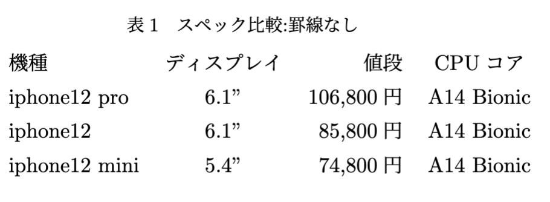

# Texで書く 
# 02 実践編(本文，図，表，参考文献)

---
# 目次
1. Texのファイル構成
1. Sampleを使う
2. 編集してタイプセット(実行)してみる
3. 文章の書き方
    1. タイトル
    2. 章立て
    3. 本文
4. 図の挿入と配置
5. 表の配置
6. 参考文献の挿入
---

# 1．Texのファイル構成
### .tex
Texの本文ファイル．文章を書く時はこのファイルを編集する．

### .bib
参考文献をまとめるファイル．
.texファイルで参照することで参考文献を本文に取り込みことができる．

### .sty
フォントや行間などTexの体裁(スタイル)を設定する．

### .log
タイプセット実行時の編集内容を記録する．
 
---
 # 2. Sampleを使う．
スタイルシートで1から体裁を作っても良いが，学会などでは体裁を統一するために，既に整えられたTexのサンプル一式が用意されている場合が多い．

レポートを作成する際にも，あらかじめレポート用の体裁に整えたサンプルを
用意しておけば，一からTexやWordでフォントサイズなど調整しなくて済む．

<span style="color:red;">
tex_sampleフォルダにレポートやレジュメ卒論用のサンプルを用意してあるので，
自由に使用すると良い．
</span>

このチャプターではtex_sample内のresume_texSampleを使って解説する．

---
# 3. 編集してタイプセット(実行)してみる
ここでは，VS Code(VSC)を使用してresume_texSampleの内容を編集していく．
VSCでTexを書く手順として，編集→タイプセット(コンパイル)→プレビュー
の順を追っていく．

- VSCでのタイプセット
    - Mac : command + option + b
    - Win : ctrl + alt + b

- VSCでのプレビュー
    - Mac : command + option + v
    - Win : ctrl + alt + v
---

## 4. 文章の書き方
本文を編集する．
基本的に `\maketitle` の下からが本文となり，`\section{}`ごとに章立てが分かれている．`\section{}`の{}に章タイトルが入る．

``` tex
\section{初めに} %章
本文は\textbackslash maketitleの下から描き始める．
〜

\subsection{} %節
```


`\subsection{}`は小節を指定するときに使う．
`%`はコメントアウト

---
## 5. 図の挿入と配置
図は以下のように挿入する．`\includegraphics`で図を指定する．
[]にはオプションで図のサイズを指定できる．

``` tex
\begin{figure}[h] %オプション[h,t,b,p]
	\begin{center} % センタリング
		\includegraphics[width=30mm]{img/kikpond.eps}
	 \end{center}
	\caption{サンプル画像} %図のキャプション
	\label{fig:sample} %参照する時のラベル
\end{figure}
```
---
挿入した図を参照するときは，`\ref{図のラベル}`を記入する．


```tex
%記法
図\ref{fig:sample}では〜

%出力結果
図1では〜

```
図の位置は自動で調整されるので，自由な配置は難しい．
figure[オプション]である程度位置の指定はできる．
h(here)，t(top)，b(bottom), p(独立したページ)

---
## 6. 表の挿入

表は`\begin{table}[h]`を使う．論文内で表を参照する場合は
図と同様に`\ref{}`を使用する．

```tex
\begin{table}[htb]
	\centering
	 \caption{スペック比較:罫線なし}
	  \begin{tabular}{lcrc}
		機種 & ディスプレイ & 値段 & CPUコア \\
		iphone12 pro & 6.1" & 106,800円 & A14 Bionic \\
		iphone12 & 6.1" & 85,800円 & A14 Bionic \\
		iphone12 mini & 5.4" & 74,800円 & A14 Bionic
	  \end{tabular}
	  \label{tab:sample01}
	\end{table}
```

---
表示結果は以下のようになる．
<div align="center">

</div>

---

線ありだとおこんな感じ
```tex
	\begin{table}[htb]
		\centering
		  \caption{スペック比較:罫線あり}
		  \begin{tabular}{|l||c|r|c|}  \hline
			機種 & ディスプレイ & 値段 & CPUコア \\ \hline \hline
			iphone12 pro & 6.1" & 106,800円 & A14 Bionic \\ \hline
			iphone12 & 6.1" & 85,800円 & A14 Bionic \\ \hline
			iphone12 mini & 5.4" & 74,800円 & A14 Bionic \\ \hline
		  \end{tabular}
		  \label{tab:sample02}
		\end{table}
```
---
結果はこんな感じ．
<div align="center">

</div>

---
## 7. 参考文献の挿入
参考文献の挿入には.texファイルに直接書き込む方法と
bibtexファイル(.bib)に書き込む方法の2通りがある．

このチャプタではbibtexファイルにまとめる方法を紹介する．

---
.texファイルの末尾に`\bibliography{}`を追加し
{}内に参照するbibファイルを指定する．
`\bibliographystyle{junsrt}`にて，論文内で参照される順番で文献をソートしてくれる．

```tex
\bibliography{test_bibtex} % BibTeX ファイル (.bib) を記述
\bibliographystyle{junsrt} % 番号を掲載順にソートする．

\end{document} % 文の最後
```
---
bibtexの書き方．論文を引用する場合下記のように`@article`を使用する．
`@article{test,`のtestは.texファイルで参照する任意の名前である．

```bibtex
%論文の場合
@article{test,
  title={人工現実感を利用した三次元空間内作業用マンマシーンインターフェース},
  author={廣瀬通孝},
  journal={ヒューマン インターフェース シンポジウム論文集},
  pages={201--206},
  year={1988}
}
```
---
論文内で参照する場合，`\cite{}`を使用する．先ほどのtestを参照する場合

```tex
廣瀬らは三次元空間内での作業用インタフェース\cite{test}を提案している．

%出力結果
廣瀬らは三次元空間内での作業用インタフェース[1]を提案している．
```


