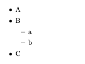
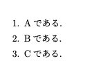
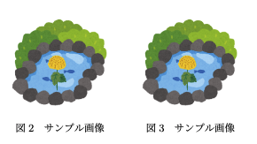

# Texで書く 
# 03 応用編(ラベル，定義，箇条書き，図の複数配置)

---
# 目次

1. ラベル
2. 定義
4. 箇条書き
5. 図の複数配置

---
# 1. ラベル
ラベルは図や表，数式を参照するときに使用するが，章や節にも使用することができる．
ラベルをつけるときの名前は任意であるが，下記の表のように種類ごとに頭文字を設定すると参照するときに見分けやすい．

<div align="center">

|種類 |ラベルの付け方 |参照の仕方 |
| -- | -- | -- |
| 図 | \label{fig:name} | \ref{fig:name} |
| 表 | \label{tab:name} | \ref{tab:name} |
| 数式 | \label{eq:name} | \ref{eq:name} |
| 章・節 | \label{sec:name} | \ref{sec:name} |

</div>


---
# 2. 定義
texでは定義を使用して，長い単語などを任意のコマンドに置き換えることができる．

```tex
%\maketitleの上で定義する
\newcommand{\long}{めっちゃ長いテキストなので毎回打つのめんどくさいうやつ}

%論文内での参照
\long{}
```

定義に引数を与えることも可能である．

---
# 3. 箇条書き
箇条書きは以下のようにし`\item`を使用する．
`\begin{itemize}`と`\end{itemize}`で囲む．
下のようにitemizeの中にitemizeを入れることで小項目も入れることができる．

```tex
\begin{itemize}
\item A
\item B
    \begin{itemize}
        \item a
        \item b    
    \end{itemize}
\item C
\end{itemize}
```
---
出力結果


---

先ほどの`itemize`を`enumerate`にすることで番号付きの箇条書きにすることもできる．
```tex
\begin{enumerate}
   \item Aである．
   \item Bである．
   \item Cである．
\end{enumerate}

```
出力結果


---
# 4. 図の複数配置
下のように図を複数並べて表示させたいときは．`\minipage`を使用する．
```tex
\begin{figure}[htbp]
  \begin{minipage}[b]{0.45\linewidth}
    \centering
    \includegraphics[keepaspectratio, width=30mm]{img/kikpond.eps}
    \caption{サンプル画像}
  \end{minipage}
  \begin{minipage}[b]{0.45\linewidth}
    \centering
    \includegraphics[keepaspectratio, width=30mm]{img/kikpond.eps}
    \caption{サンプル画像}
  \end{minipage}
\end{figure}
```

